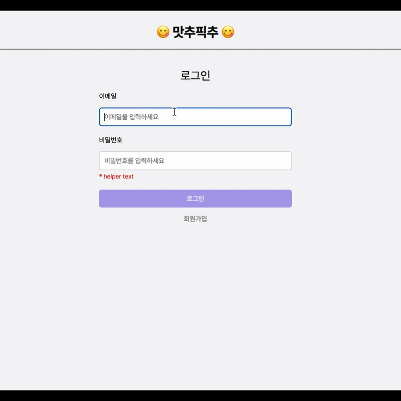
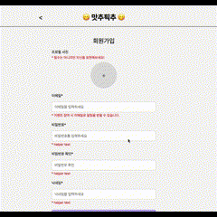
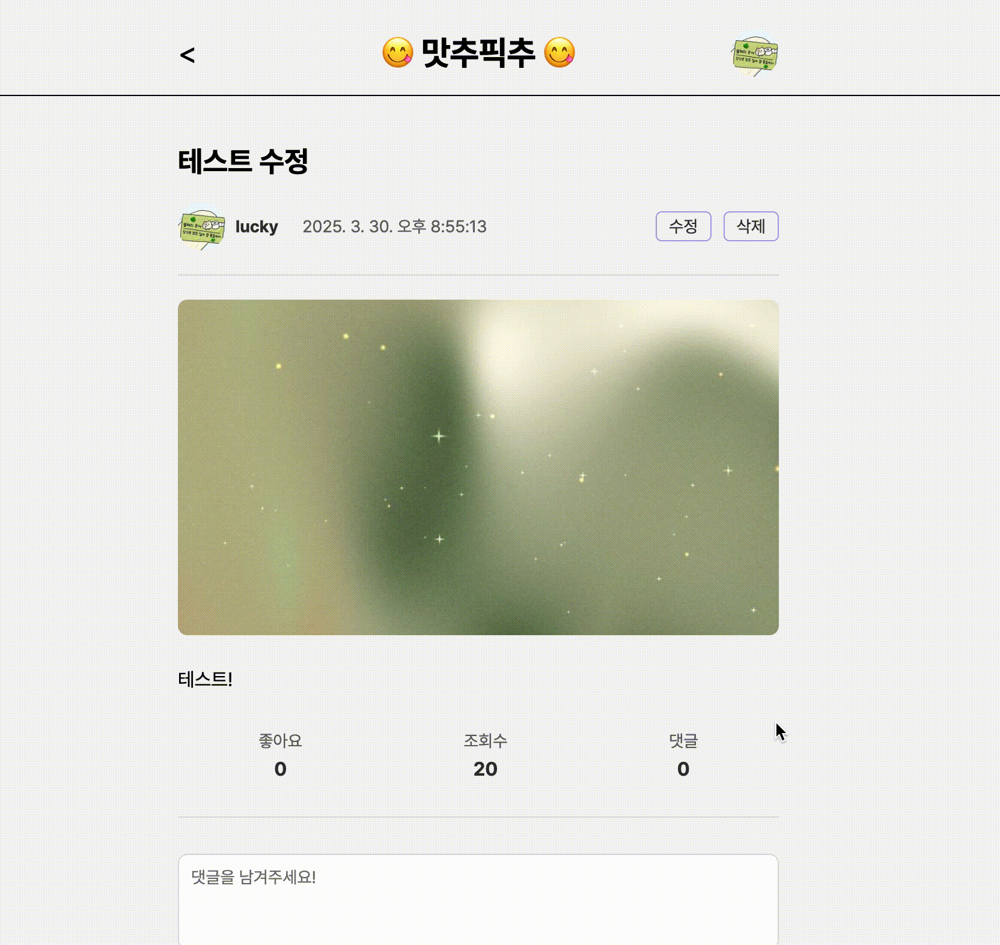
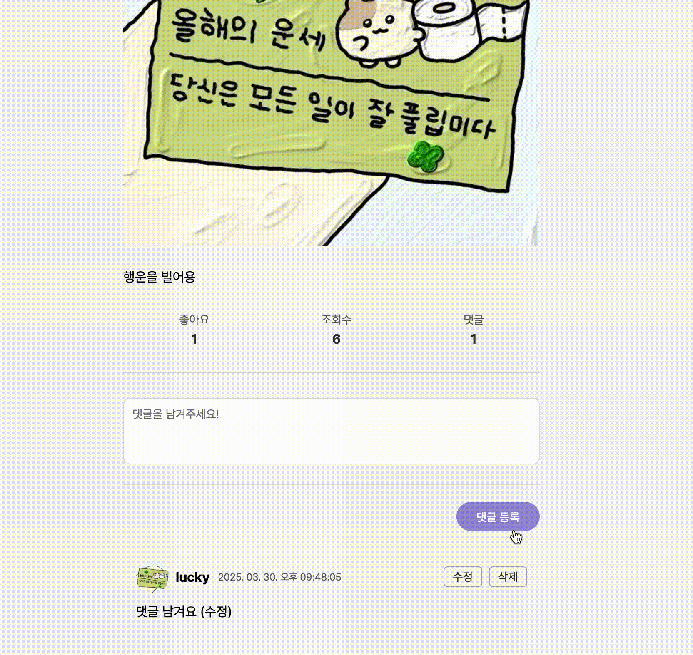
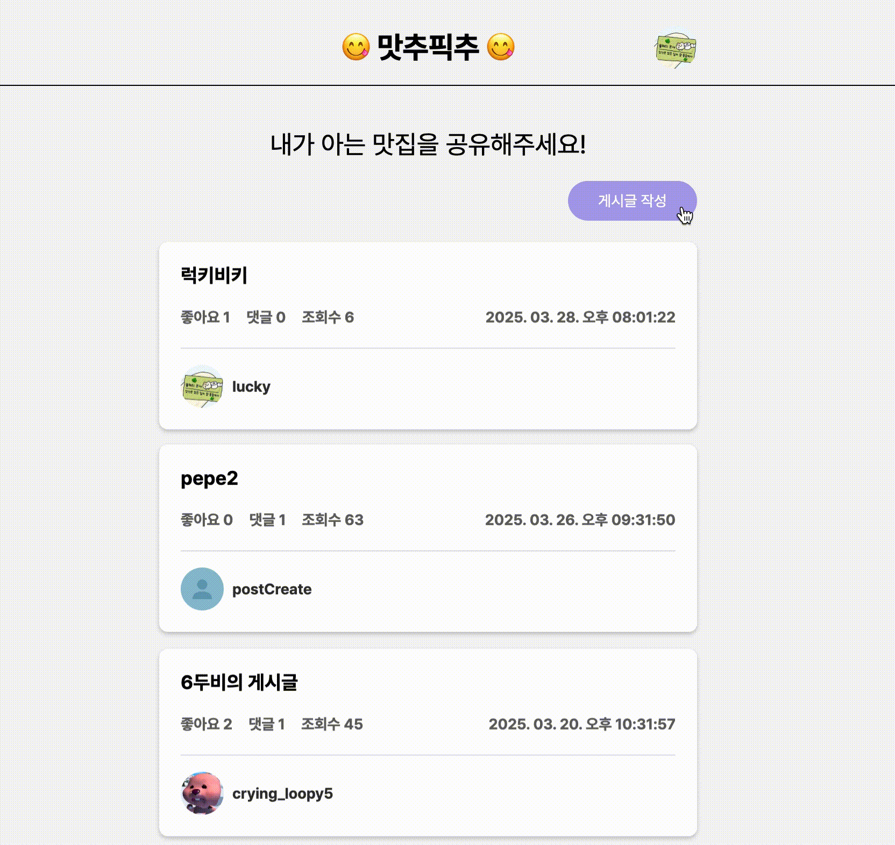
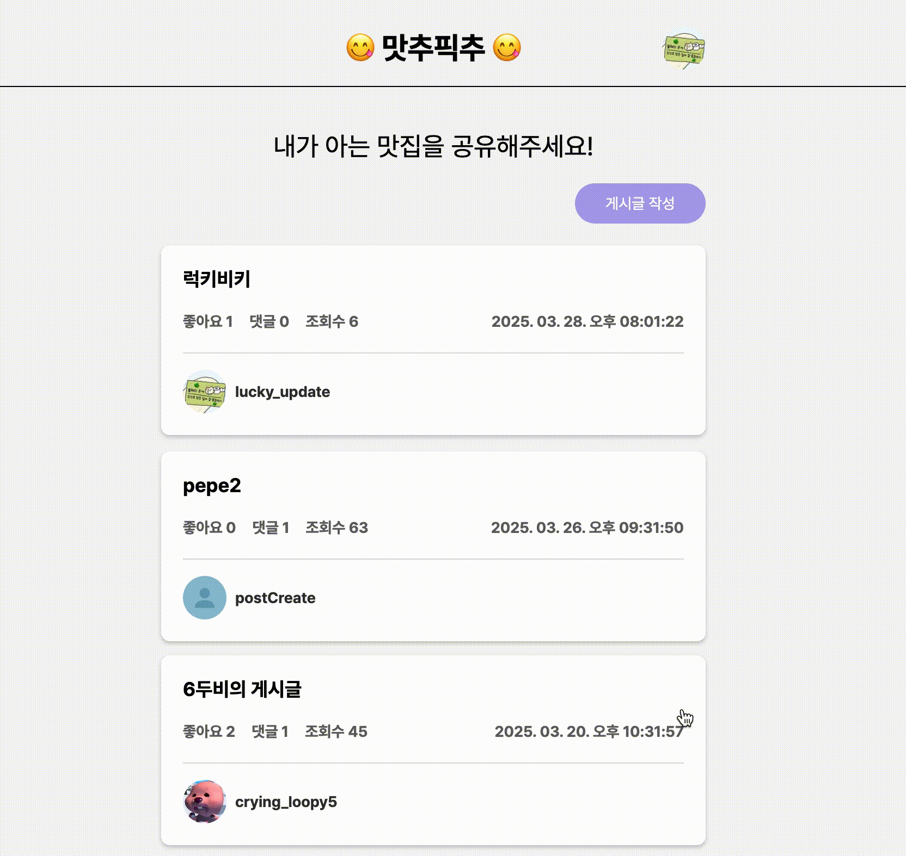
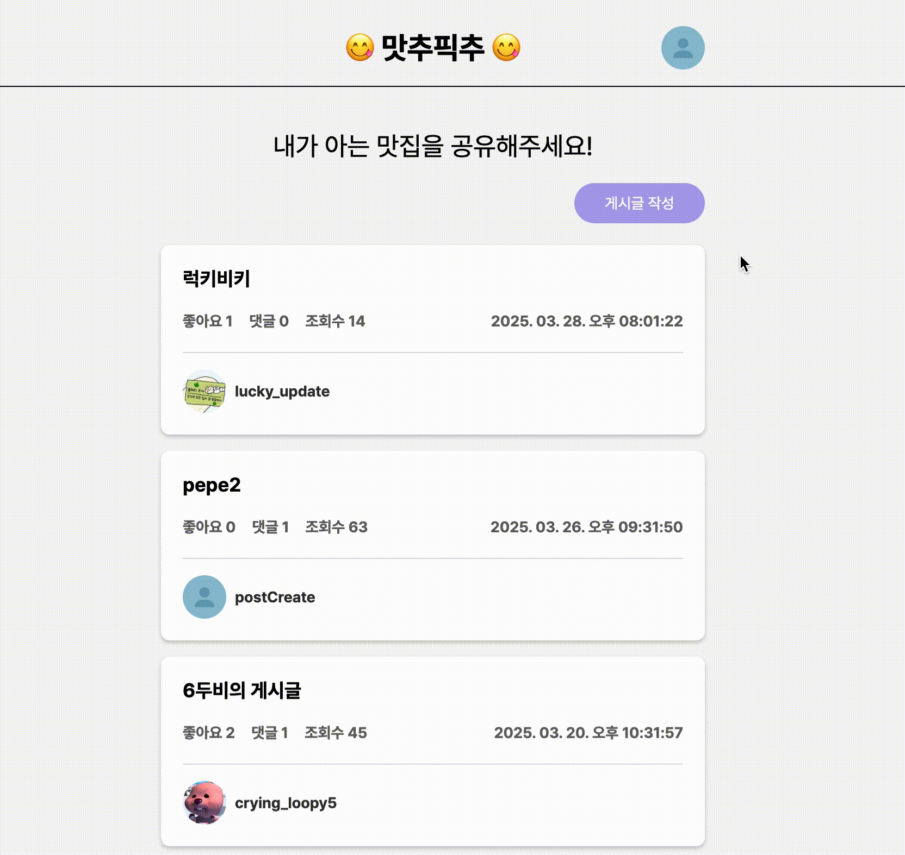
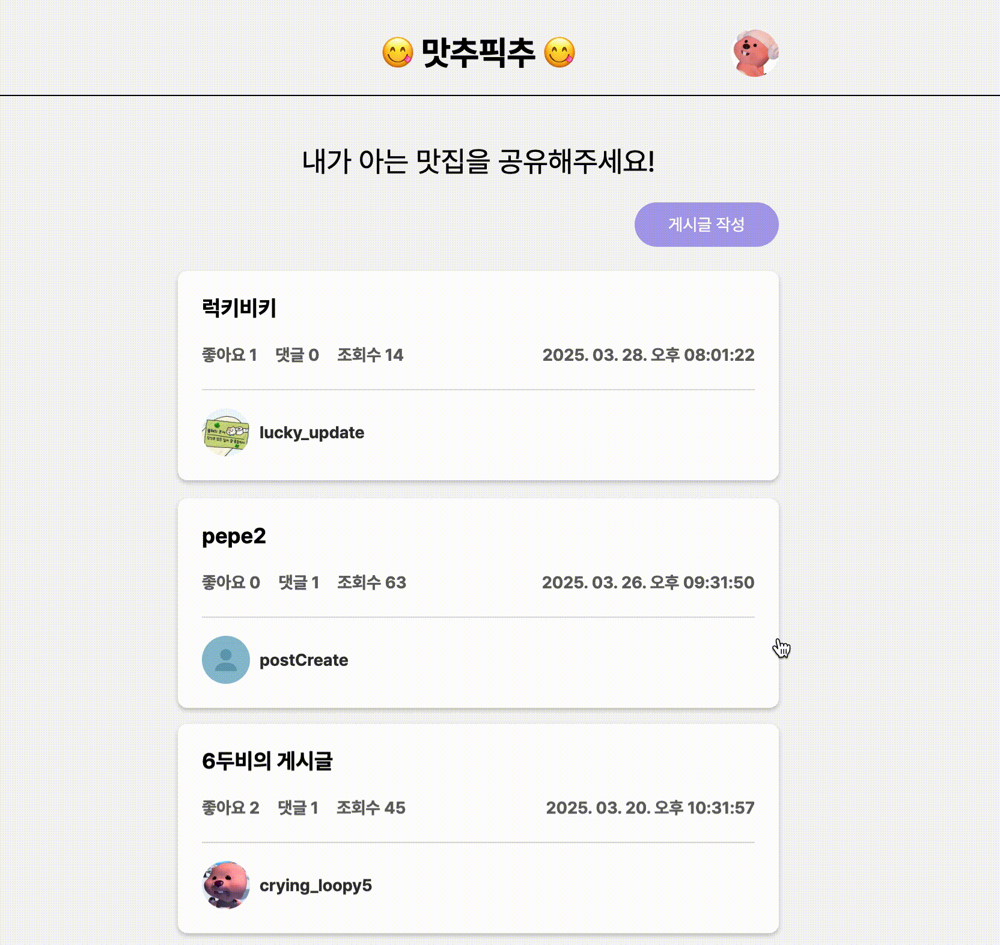

# 😋 맛추픽추

> 카카오 부트캠프 풀스택 6차 과제 (Frontend)

**맛추픽추**는 서울의 맛집과 카페를 공유하는 커뮤니티 웹 서비스입니다.  

지하철역별로 맛집을 공유하고, 직접 방문한 장소를 자랑해보세요! 

## ✅ 프로젝트 소개

이 프로젝트는 지인들끼리 서울 맛집 정보를 쉽게 공유할 수 있도록 기획되었습니다.  
맛집 정보와 후기 게시글을 올리고, 댓글과 좋아요를 통해 소통할 수 있습니다.  

## ✅ 개발 기간 / 인원 / 기술 스택

- 개발 기간 : 2025.03.16-2025.03.30
- 개발 인원 : 1명
- 기술 스택 : HTML / CSS / Vanilla.js
- <a href="https://github.com/100-hours-a-week/2-kylie-cho-community-be">맛추픽추 Backend Github</a>

## ✅ 기능

1. 로그인 / 회원가입
2. 게시글 작성
3. 게시글 목록 조회
4. 게시글 상세 조회
5. 게시글 수정 및 삭제
6. 댓글 및 좋아요
7. 댓글 수정 및 삭제
8. 회원정보 수정
9. 비밀번호 수정
10. 로그아웃 / 회원탈퇴

## ✅ 화면 구성

- 홈

  |로그인|회원가입|
  |---|---|
  |||

- 게시글 조회 / 생성 / 수정 / 삭제

  |게시물 생성|게시글 수정|게시글 삭제|
  |---|---|---|
  ||||

- 댓글 조회 / 생성 / 수정 / 삭제

  |댓글 생성|댓글 수정|댓글 삭제|
  |---|---|---|
  ||||

- 회원정보 수정 / 비밀번호 수정 / 회원 탈퇴 / 로그아웃

  |회원정보 수정|비밀번호 수정|회원 탈퇴|로그아웃|
  |---|---|---|---|
  |||||

- 좋아요 생성 / 삭제

  |좋아요 생성.삭제|
  |---|
  ||

## ✅ 회고

### 아쉬웠던 점
- 효율적인 파일 분리
  
  지금 상태의 파일 분리는 그냥 하나의 파일에 너무 많은 코드가 쌓이지 않도록 하기 위해 분리한 느낌이다.

  특히 Post, Comment, Heart가 서로 연관된 관계이다 보니 Post 파일에 Comment나 Heart 관련 코드가 많이 존재한다.

  기능별로 파일을 확실히 분리했으면 코드 수정할 때에도 훨씬 편리했을 것 같다.

- 백엔드에 집중하기
  
  그동안 프론트엔드를 많이 맡아서 그런지 무의식적으로 프론트엔드 요소들에 더 집중하게 됐다.

  프론트엔드의 사소한 스타일이나 이벤트 처리 등에 불필요하게 시간을 쏟았다는 생각이 든다.

## ✅ 향후 개발 계획
- 지하철역별 카테고리 생성
- 지도 연동